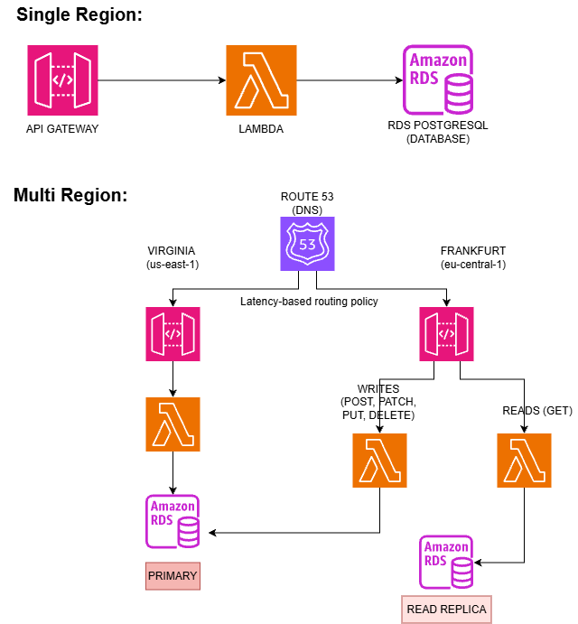
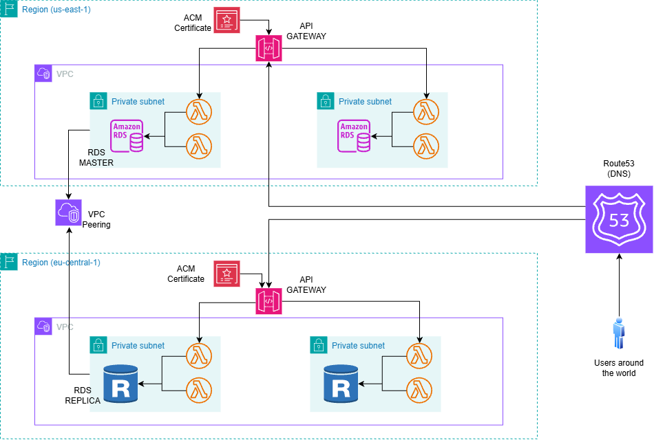
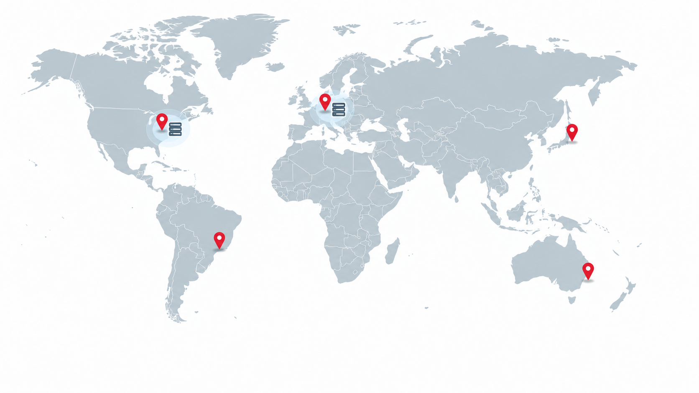

# Global Latency in AWS

AWS laboratory focused on measuring how geographic distance and multi-region architecture affect API latency for users around the world.

The experiment compares a single-region backend hosted in **N. Virginia (`us-east-1`)** against a multi-region architecture using **Frankfurt (`eu-central-1`)**, an RDS read replica and Route 53 latency-based routing.

---

## Goal

The main goal of this laboratory is to measure how backend architecture affects latency for geographically distributed users.

The experiment focuses on two different operations:

- **Reads**, which can be served from regional database replicas.
- **Writes**, which still need to reach the primary database. That is for not adding a lot of complexity with multi-master architectures if it is not completely necessary. 

The tests were executed from several locations around the world to compare the end-to-end latency of each architecture.

---

## High-Level Idea

The initial architecture keeps the entire backend in N. Virginia.

In the multi-region version:

- Requests routed to N. Virginia use the primary RDS database.
- European reads are served by an RDS read replica in Frankfurt.
- Writes received in Frankfurt still operate against the primary database in N. Virginia.

---

## Architecture

The final architecture includes two AWS regions connected through inter-region networking.

Main components:

- Amazon API Gateway
- AWS Lambda
- Amazon RDS for PostgreSQL
- Cross-region RDS read replica
- Amazon Route 53
- Latency-based routing
- Multiple VPCs
- Inter-region VPC connectivity with VPC Peering
- Private subnets and security groups

---

## Test Locations

Requests were generated from five different geographic locations using Grafana Cloud k6:

- N. Virginia
- Frankfurt
- São Paulo
- Tokyo
- Sydney

This allowed the same API architecture to be tested from different parts of the world without deploying clients manually in every region.

---

## What Was Tested

Six different scenarios were measured.

### Reads

1. Reads against the N. Virginia endpoint.
2. Reads against the Frankfurt endpoint.
3. Reads through the Route 53 global endpoint.

### Writes

4. Writes against the N. Virginia endpoint.
5. Writes against the Frankfurt endpoint.
6. Writes through the Route 53 global endpoint.

For every scenario, requests were generated from:

- N. Virginia
- Frankfurt
- São Paulo
- Tokyo
- Sydney

The main metrics collected were:

- Average latency
- p95
- p99
- Minimum latency
- Maximum latency

---

## Testing Methodology

Load generation was performed using **Grafana Cloud k6**.

Each geographic test used the same configuration so that the main variable being changed was the origin of the request.

The tests used low concurrency because the primary goal was to measure **geographic latency**, rather than backend throughput or saturation.

Example test configuration:
- 1 virtual user
- 1 minute duration
- 1 request approximately every second
The same workloads were then repeated against the different regional and global endpoints.
The goal was not to stress the system, it was to see the latency behavior.

---

## Repository Structure

- lambdas/ : Lambda source code
- scripts/: k6 testing scripts for reads and for writes
- report/: Results and analysis
- README.md
- architecture.png
- areasToTest.png
- highLevelIdea.png

---

## Results
The full measurements and detailed analysis of the 6 datasets are available in the report:

[`report/`](./report/)

Some of the most relevant results were:

- A read request from Frankfurt took **146 ms on average** when served entirely from N. Virginia, but only **34 ms** when served by the Frankfurt API, Lambda and read replica --> approximately a **77% reduction**.
- Writes from Frankfurt showed almost identical average latency when sent directly to Virginia (**129 ms**) or through the Frankfurt API (**130 ms**), because both execution paths eventually have to reach the primary database in N. Virginia.
- Sending writes from São Paulo through Frankfurt increased average latency to **331 ms**, compared with **146 ms** when writing directly through the Virginia endpoint.
- Tokyo achieved better results against the Virginia endpoint than through Route 53 in this experiment. Reads averaged **201 ms** against Virginia versus **296 ms** through Route 53, while writes averaged **186 ms** against Virginia versus **359 ms** through Route 53.
- Sydney also performed significantly better against Virginia than Frankfurt, particularly for writes: **230 ms** versus **420 ms** on average.

These results show that regionalizing reads can provide major latency improvements, while write latency remains strongly constrained by the location of the primary database.

## Main Takeaways

### 1 - Regional read replicas can reduce read latency
In Frankfurt, average read latency dropped from 146 ms against Virginia to 34 ms against the Frankfurt replica.

### 2 - Moving compute closer to users does not necessarily improve writes
Frankfurt writes took 129 ms through Virginia and 130 ms through Frankfurt because both paths still had to reach the primary database in Virginia.

### 3 - Poor regional routing can make writes much worse
São Paulo writes took 146 ms through Virginia but 331 ms through Frankfurt because the request crossed regions unnecessarily.

### 4 - Latency-based routing is not always the best option
Route 53 latency-based routing optimizes the path to the regional endpoint, but it does not understand internal application dependencies. Tokyo showed that the nearest API region is not always the best end-to-end path.

### 5 - Two regions are not enough to make an architecture global
Users in Tokyo, Sydney and São Paulo still experienced relatively high latency.

### 6 - Reads are easier to distribute than writes
Read replicas can bring data closer to users, while a single-primary write model keeps write latency tied to the primary region.

## Tech Stack
* AWS
* Amazon API Gateway
* AWS Lambda
* Amazon RDS PostgreSQL
* Amazon Route 53
* Amazon VPC
* Grafana Cloud k6
* Node.js